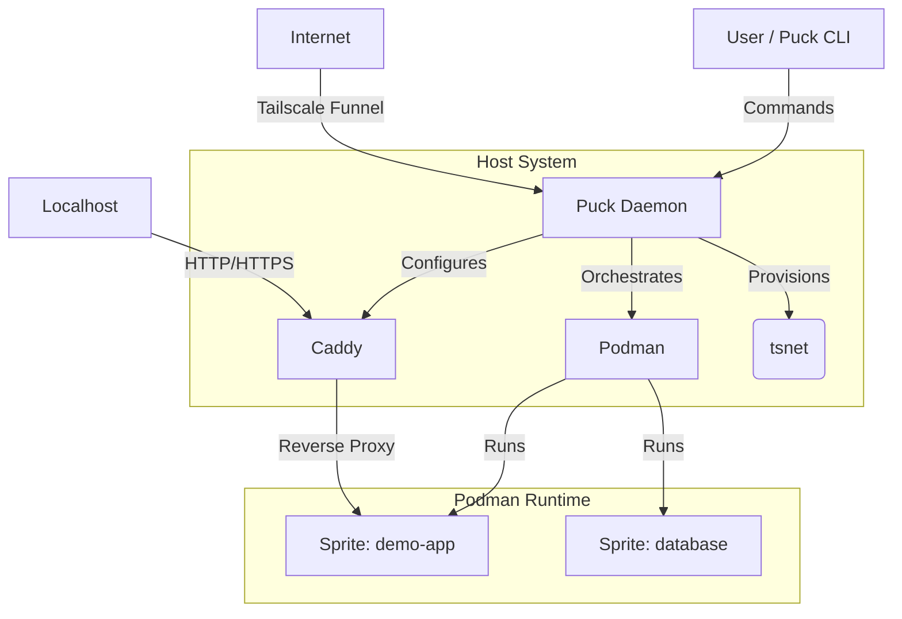

# System Design Document: Puck
**"Sprites on Localhost"**

**Version:** 0.1 (Draft)
**Status:** Proposal
**Author:** [Your Name/AI]

---

## 1. Executive Summary

**Puck** is a Golang-based CLI tool designed to bring the "Sprite" developer experience (as defined by Fly.io) to localhost.

While Docker and standard container workflows emphasize statelessness and ephemerality, Puck emphasizes **durability**, **statefulness**, and **machine-like behavior**. Puck treats containers as "tiny computers" rather than application wrappers.

It leverages **Podman** for container runtime (specifically its advanced checkpoint/restore capabilities), **Tailscale** for secure mesh networking, and **Caddy** for instant local and public ingress.

## 2. Core Philosophy

1.  **Dev is Prod:** The environment you build in should persist.
2.  **No Dockerfiles:** You request a computer, you get a shell. You install things via `apt`, `apk`, or `pip`.
3.  **Durability:** Filesystem changes are persisted automatically.
4.  **Pause, Don't Die:** When not in use, computers should sleep (checkpoint), not vanish.

## 3. Architecture Overview

Puck operates as a single binary acting as an orchestrator. It manages a local "fleet" of Sprites.

### The Stack
*   **Language:** Go (Golang)
*   **Runtime:** Podman (via Go bindings or CLI wrapper)
*   **Networking:** Tailscale (`tsnet` library) & Caddy (embedded or sidecar)
*   **State:** SQLite (local metadata store)

### High-Level Diagram

## 4. Detailed Component Design

### 4.1. The Sprite (Container Design)
Unlike a standard Docker container which runs an `entrypoint.sh` and exits, a Puck Sprite runs a proper init system (systemd or s6-overlay) to simulate a full OS.

*   **Base Image:** A custom "fat" Alpine or Debian image pre-loaded with `systemd`, `sshd`, `curl`, `git`, and `vim`.
*   **Storage:** 
    *   Root FS is read-write.
    *   Podman Named Volumes are automatically mounted to preserve `/home`, `/etc`, and `/var`.
    *   **Goal:** `apt-get install ffmpeg` persists across restarts.

### 4.2. Runtime Orchestration (Podman)
Puck interacts with Podman using the `containers/podman/v5` Go bindings.

*   **Creation:** `podman run --detach --systemd=true --name <sprite-id> ...`
*   **Checkpointing (The "Sleep" Mechanic):**
    *   Puck utilizes **CRIU** (Checkpoint/Restore In Userspace) via Podman.
    *   Command: `podman container checkpoint --export=<path> <sprite-id>`
    *   Allows the Sprite to freeze state (memory + process) to disk.
    *   **Restore:** Instantly brings the memory back to RAM.

### 4.3. Networking (The "Connect" Layer)

This is the most complex layer, handling both localhost access and public sharing.

#### A. Local Ingress (Caddy)
Puck embeds Caddy (using Caddy as a library).
*   Puck automatically modifies the Caddy configuration to map `http://<sprite-name>.localhost` to the container's internal IP/Port.
*   **Benefit:** Zero-config HTTPS locally.

#### B. Public/Mesh Ingress (Tailscale)
Puck embeds the **Tailscale `tsnet`** library.
*   Each Sprite does *not* need the Tailscale daemon installed inside it.
*   Puck runs a lightweight userspace networking proxy on the host.
*   **Mode 1 (Mesh):** Access via `http://<sprite-name>.<tailnet-name>.ts.net` (Private).
*   **Mode 2 (Funnel):** Access via public internet (for webhooks/demos) using Tailscale Funnel.

### 4.4. The Daemon (`puckd`)
To handle wake-on-request, Puck needs a background process.
*   **Watcher:** Monitors TCP traffic destined for a Sprite's address.
*   **Logic:**
    *   If traffic hits `sprite-1.localhost` AND container is `Paused/Checkpointed`:
    *   Hold request -> Restore Container (CRIU) -> Forward Request.
    *   If no traffic for 15 mins -> Checkpoint Container.

## 5. CLI Specification

The user interface mimics the Fly.io Sprites proposal.

### `puck create [name]`
1.  Checks local image cache (pulls `puck/base:latest` if needed).
2.  Creates a Podman volume for durability.
3.  Starts the container.
4.  Updates local DNS/Caddy map.
5.  **Output:** `✓ Created sprite 'demo-1' (accessible at http://demo-1.localhost)`

### `puck console [name]`
1.  Connects to the Sprite.
2.  Executes `podman exec -it <name> /bin/bash`.
3.  User is dropped into root shell.

### `puck snapshot create [name]`
1.  Freezes the container (CRIU).
2.  Exports the checkpoint to a local binary file.
3.  Metadata recorded in SQLite.
4.  Unpauses container.

### `puck snapshot restore [snapshot-id]`
1.  Stops current container.
2.  Replaces container state with binary checkpoint file.
3.  Resumes execution (memory is identical to snapshot time).

### `puck expose [name]`
1.  Activates `tsnet` for this sprite.
2.  Generates a Tailscale Funnel URL.
3.  **Output:** `✓ Forwarding https://demo-1.tailnet.ts.net -> Sprite:8080`

## 6. Implementation Challenges & Solutions

### Challenge 1: Rootless Networking
**Problem:** Podman rootless containers have difficulty exposing ports and preserving source IPs.
**Solution:** Use `slirp4netns` (default in Podman) combined with Caddy acting as a reverse proxy on the host user's network stack.

### Challenge 2: Checkpoint Compatibility (Architecture)
**Problem:** CRIU is highly dependent on kernel versions. Checkpoints made on Linux won't restore on Mac (natively).
**Solution:**
*   **Linux Users:** Native Podman + CRIU.
*   **Mac/Windows Users:** Puck orchestrates a **Podman Machine** (a hidden Linux VM). All sprites run inside this VM. Puck proxies commands into the VM.

### Challenge 3: The "Clean Slate" Trap
**Problem:** Users accidentally deleting containers via standard Docker tools (`docker rm`), losing the durable volume.
**Solution:** Puck tags resources with `managed-by=puck`. Puck warns heavily if a user tries to delete a Sprite without the `--force` flag.

## 7. Roadmap to MVP

1.  **Phase 1 (The Shell):** Go CLI that wraps `podman run` with persistent volumes and standardizes the base image. `puck create`, `puck console`.
2.  **Phase 2 (The Network):** Integrate Caddy (library) to auto-proxy `*.puck.local` to container IPs.
3.  **Phase 3 (The Checkpoint):** Implement `puck freeze` using `podman container checkpoint`.
4.  **Phase 4 (The Mesh):** Integrate `tsnet` for Tailscale support.

---

## 8. Example Workflow (User Story)

**User:** "I want to test a Python script that needs FFmpeg and processes a webhook."

1.  `> puck create media-bot`
    *   *System boots a persistent Ubuntu container.*
2.  `> puck console media-bot`
    *   `root@media-bot:~# apt install ffmpeg python3`
    *   `root@media-bot:~# python3 server.py` (Listens on port 8080)
3.  `> puck expose media-bot --public`
    *   *Returns: https://media-bot.tailnet.ts.net*
4.  **User sends webhook from GitHub to that URL.**
5.  **User closes laptop.**
    *   *Puck daemon detects inactivity. Checkpoints `media-bot` to disk to save RAM.*
6.  **Next day.**
    *   User runs `puck console media-bot`.
    *   Container restores in <1s. FFmpeg is still installed. Command history is intact.
